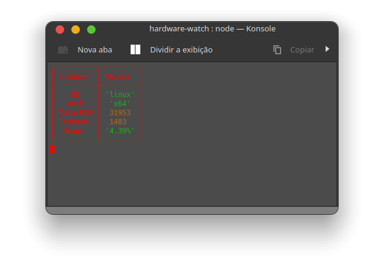

# RAM Memory
Projeto prático para visualizar consumo de memória RAM com NODEJS.

### Preview

## Como iniciar o monitor:

1. Clone do repositório

`$ git clone git@github.com:wr2net/hardware-watch.git`

2. Rodando

`$ node server.js`
